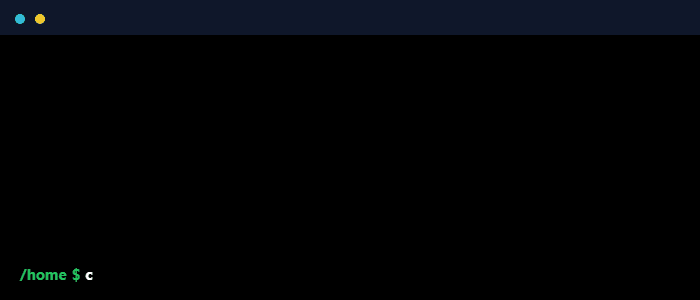

<!--
    Hey there, I'm William Baltus!
    Thanks for checking out my profile README source
    Feel free to reuse pieces of this – and if you do, a star / follow is always appreciated.
-->

<!--
    If you want a custom terminal GIF like Daria's example,
    export it and just drop it into /assets and update the path below.
-->

  <!-- Replace ./assets/about_me.gif with your own terminal-style GIF if you make one -->
  

---

### 🧠 About Me

- 🛰️ Built **space-hardened software** for the LM400 satellite line in Python & C++ with rigorous testing and simulation.
- 🤖 Designed **production RAG systems** with Elasticsearch (BM25 + dense/sparse vectors) and LLMs over 1M+ records.
- 🧾 Modernized enterprise **payroll validation** into automated, observable pipelines with FastAPI & PostgreSQL.
- 🛠 I love turning messy systems into **clean architectures, reusable frameworks, and quiet automation**.

---

### 🧩 Main Skills

#### 💻 Languages & Core

---

#### 🧬 DataBase / Search

---

#### 🌐 Web Development

---

#### ☁️ Cloud, DevOps & Hosting

---
##### 🧱 AI + Frameworks

  
  
  
  
  
  

---

### 🤝 Connect with Me

  
  <!-- Add more badges if you’d like (blog, portfolio, etc.) -->

---
> [!IMPORTANT]  
> 📎 **Resume:**  
> • [Notion resume](https://grey-cloth-861.notion.site/William-Jaunius-Baltus-e4729f9c870f4ab4a0421ca461e07b57?pvs=74)
> 

    

 

<!--
    Thanks for stopping by 
-->
